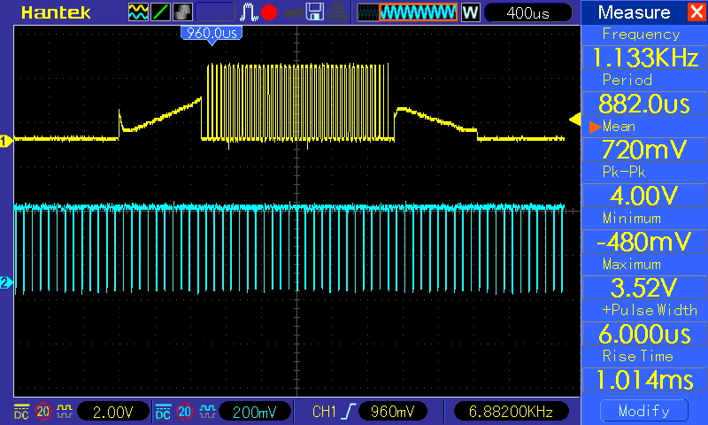

# DRV2605(L) on STM32

Waveform tested with this hardware setup 

## Harware Setup
- NUCLEO-STM32H755ZI Development Board
- Adafruit DRV2605L Breakout Board
 - [DRV2506L Datasheet](https://www.ti.com/lit/gpn/drv2605l)
- Rotary Potentiometer
- Vybronics VG0840001D LRA
- 2-Position Slide Switch

## Operation Modes
This example is a demo of using STM32 microcontroller to control DRV2605L haptic driver via I2C and PWM. A 2-position slide swith connected to one of the GPIO14 determines whether the device is controlled via I2C to play internal vibration effect or via PWM to modulate the strength of vibration using a rotary potentiometer.

### I2C and internal Waveform Library Effects
When the STM32 is connected to a external host via UART and the slide switch on GPIO14 is in the I2C position, the program reads a string of 1 to 115 from the UART and play the corresponding vibration from the internal Waveform Library Effects List (datasheet sec. `12.1.2`) in DRV2605. The I2C interface can also be used to control the driver with Real-Time Playback (RTP) Interface, which modulates the strength of vibration stored in a 8 bit I2C-writable register and triggered by wirting the `GO` bit in register `0x0C` via I2C. Refer to datasheet sec. `8.3.5.3` for more information on the RTP mode and sec. `8.3.5.6` for I2C triggering. 

### PWM Playback
When the slide switch on GPIO14 is in PWM position, the program reads the value from a rotary potentiometer connected to the ADC as the strength of the vibration motor. The PWM signal is then feed to the IN/TRIG pin on DRV2506. In this mode, the motor is always on. Refer to datasheet sec. `8.3.5.1` for more information.

## Programming [`main.c`](/CM7/Core/Src/main.c)
Every function is programmed in [/CM7/Core/Src/main.c](/CM7/Core/Src/main.c). This section goes through the source code to explain how to control the DRV2605 driver.

### Calibration
In the main function, the programm first perform the DRV2605 startup calibration procedure in the `/* USER CODE BEGIN 2 */` block. The startup calibration encures the motor is driven most efficiently. **Hold down the motor on the table on device startup to ensure the calibration result converges.** If the motor is moving due to the calibration vibration, the calibration will most likely fail. Optionally, read the `DIAG_RESULT` bit in register `0x00` to determine if the calibration succeeded.

The calibration procedure requires setting some register values related to the specification of the motor used. Please refer to datasheet sec. `8.5.6` for detailed description and calculation needed for the calibration parameters.

### I2C

### PWM

## References
- [DRV2506L Datasheet](https://www.ti.com/lit/gpn/drv2605l)
- Waveform tested with this hardware setup 